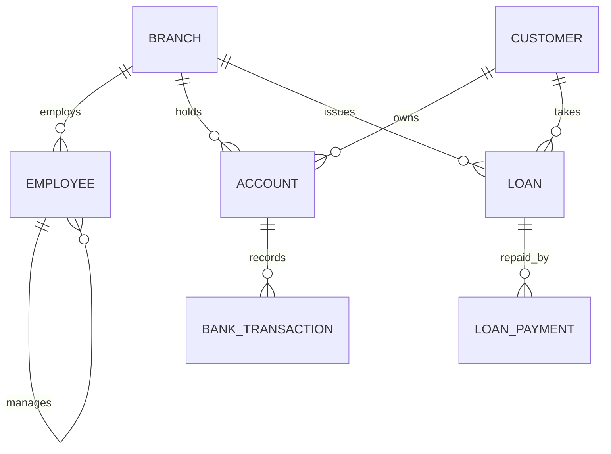

# Bank Management System (MySQL) - CSE3001 DBMS Project

## 1. Problem statement
A bank keeps customers, their accounts, branch and employee data, transactions, and loans with repayments. The system must keep balances consistent (ACID), prevent overdrafts, audit changes, and give reports.

## 2. Requirements and run order (MySQL 8.0.16+; 8.0.31+ for INTERSECT/EXCEPT)
| Step | File | Purpose |
|---|---|---|
| 1 | `01_schema.sql` | Creates `bank_db`, tables, constraints, indexes, views |
| 2 | `02_triggers.sql` | Balance update, overdraft check, audit, branch assets, salary rule |
| 3 | `03_sample_data.sql` | Test data |
| 4 | `04_queries.sql` | Joins, aggregates, subqueries, set operations |
| 5 | `05_routines.sql` | Stored procedures, functions, cursors, handlers |
| 6 | `06_transactions_demo.sql` | Commit, rollback, savepoint, isolation, locks, deadlock |
| 7 | `07_backup.sh` | mysqldump backup and restore |
| 8 | `bank_app.py` | Python CLI (`pip install mysql-connector-python`) |

Run from the terminal: `mysql -u root -p < 01_schema.sql` and so on, or open each file in MySQL Workbench and execute it.

## 3. ER model

All relationships are 1:N. Loan_Payment depends on Loan (ON DELETE CASCADE). Employee has a recursive relationship through `manager_id`. A drawn diagram is in `Bank_ER_Diagram.docx`.

## 4. Relational schema
- Branch(**branch_id**, branch_name, city, assets)
- Customer(**customer_id**, name, dob, phone, email, address)
- Employee(**emp_id**, name, position, salary, *branch_id*, *manager_id*)
- Account(**account_no**, *customer_id*, *branch_id*, acc_type, balance, open_date, status)
- Bank_Transaction(**txn_id**, *account_no*, txn_type, amount, txn_date, description)
- Loan(**loan_id**, *customer_id*, *branch_id*, amount, interest_rate, start_date, status)
- Loan_Payment(**payment_id**, *loan_id*, amount, pay_date)
- Account_Audit(**audit_id**, account_no, old_balance, new_balance, operation, userid, op_date)

Bold = primary key, italic = foreign key.

## 5. Integrity rules
Entity integrity (PKs), referential integrity (FKs), domain integrity (CHECK on acc_type, status, amount > 0, balance >= 0), UNIQUE on phone and email, NOT NULL, DEFAULT values.

## 6. Normalization
Functional dependencies (examples):
- customer_id -> name, dob, phone, email, address
- account_no -> customer_id, branch_id, acc_type, balance, open_date, status
- txn_id -> account_no, txn_type, amount, txn_date
- loan_id -> customer_id, branch_id, amount, interest_rate
- branch_id -> branch_name, city, assets

Every determinant is a candidate key of its relation, so all tables are in BCNF (and so in 3NF, 2NF, 1NF). All attributes are atomic. There are no non-trivial multivalued dependencies, so 4NF also holds.
Un-normalized example for the viva: a single table (txn_id, account_no, customer_name, branch_name, branch_city, amount) repeats customer and branch data and causes update anomalies; decomposing it gives Customer, Branch, Account and Bank_Transaction.

## 7. Relational algebra and calculus examples
- Customers in Chennai: sigma_address='Chennai'(Customer)
- Names and balances: pi_name,balance(Customer JOIN Account)
- Customers with an account but no loan: pi_customer_id(Account) - pi_customer_id(Loan)
- Division: pi_customer_id,branch_id(Account) / pi_branch_id(sigma_city='Chennai'(Branch))
- Tuple calculus: { t.name | Customer(t) AND EXISTS a (Account(a) AND a.customer_id = t.customer_id AND a.balance > 50000) }
- Grouping: gamma_branch_id; SUM(balance)(Account)

## 8. Indexing and query optimization (Unit 4)
- InnoDB stores tables and indexes as B+ trees. Primary and unique keys get indexes automatically.
- Extra indexes: `Account(customer_id)`, `Bank_Transaction(account_no, txn_date)`, `Loan(customer_id)`, `Employee(branch_id)`.
- Show the plan: `EXPLAIN SELECT ...;` or `EXPLAIN ANALYZE SELECT ...;`. Compare `type = ALL` (full scan) with `type = ref` (index lookup) before and after creating an index. Refresh statistics with `ANALYZE TABLE Account;`.
- Heuristic rules the optimizer uses: push selections before joins, project early, pick the cheapest join order by cost.

## 9. Transactions, concurrency, recovery (Unit 5)
- Atomicity and consistency: `transfer` withdraws and deposits in one transaction with a SAVEPOINT; any error rolls everything back.
- Isolation: MySQL default is REPEATABLE READ; READ COMMITTED and SERIALIZABLE are shown in `06_transactions_demo.sql`. The trigger uses `SELECT ... FOR UPDATE` row locks to stop lost updates (lock-based protocol).
- Deadlock: two-session demo; InnoDB detects it (ERROR 1213) and rolls back one transaction.
- Durability and recovery: InnoDB redo log and undo log, plus `mysqldump` backups and binary-log point-in-time recovery (`07_backup.sh`).

## 10. Syllabus and lab coverage map
| Syllabus / lab item | Where |
|---|---|
| ER model, weak entity, constraints | section 3, `01_schema.sql` |
| Relational algebra, calculus | section 7 |
| Keys, integrity, normalization | sections 4-6 |
| DDL, DML, TCL, joins, set operations, group functions, subqueries | `01`, `04` |
| Indexes, views, data dictionary | `01_schema.sql`, `04_queries.sql` (information_schema) |
| Stored procedures, functions, cursors, exception handlers (MySQL's version of PL/SQL) | `05_routines.sql` |
| Triggers, audit system (Exp 5), user-defined error (Exp 10) | `02_triggers.sql` |
| Join queries with boss (Exp 11), Exp 2 style queries | `04_queries.sql` |
| Cursor with commit after every tenth row (Exp 6) | `05_routines.sql` C4 |
| Procedure and function (Exp 8, 9) | `05_routines.sql` P3, F1 |
| Backup script (Exp 4) | `07_backup.sh` |
| Transactions, locks, deadlock, recovery | `06`, section 9 |
| Python application | `bank_app.py` |

## 11. Oracle to MySQL differences (useful for the viva)
| Oracle | MySQL used here |
|---|---|
| SEQUENCE | AUTO_INCREMENT |
| VARCHAR2, NUMBER | VARCHAR, INT / DECIMAL |
| PL/SQL block | Stored procedure / function with DELIMITER |
| RAISE_APPLICATION_ERROR | SIGNAL SQLSTATE '45000' |
| Exception block | DECLARE ... HANDLER |
| NVL, SYSDATE, TO_CHAR | IFNULL, NOW(), DATE_FORMAT |
| MINUS / INTERSECT | EXCEPT / INTERSECT (8.0.31+) or NOT IN / IN |
| ROWNUM | LIMIT |
| One trigger for UPDATE OR DELETE | Separate trigger per event |
| Synonym | Not supported (use a view) |
| PL/SQL records and collections | Not supported (use temporary tables) |

## 12. Suggested screenshots for your report
ER diagram, `DESCRIBE` of every table, output of each query group, trigger firing (failed overdraft and audit table rows), `transfer` success and failure, `EXPLAIN` before and after an index, and the Python menu run.

