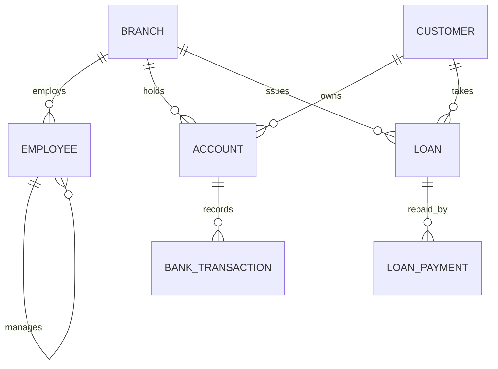

# Bank Management System — CSE3001 DBMS Project

[← Back to project README](../README.md)

## 1. Problem statement
A bank keeps customers, their accounts, branch and employee data, transactions, and loans with repayments. The system must keep balances consistent (ACID), prevent overdrafts, audit changes, and give reports.

## 2. Run order (Oracle XE / SQL*Plus / SQL Developer)
Run every script from the repository root, in the order below.

| Step | File | Purpose |
|---|---|---|
| 1 | `sql/01_schema.sql` | Tables, constraints, sequences, indexes, synonym, views |
| 2 | `sql/02_triggers.sql` | Balance update, audit, branch assets, salary rule |
| 3 | `sql/03_sample_data.sql` | Test data |
| 4 | `sql/04_queries.sql` | Joins, aggregates, subqueries, set ops |
| 5 | `sql/05_plsql.sql` | Procedures, functions, cursors, exceptions |
| 6 | `sql/06_transactions_demo.sql` | Commit/rollback/savepoint, locks, deadlock |
| 7 | `sql/07_backup.sql` | Backup scripts |
| 8 | `app/bank_app.py` | Python CLI backend (`pip install -r app/requirements.txt`) |

## 3. ER model

The same model as a Mermaid diagram (rendered natively by GitHub):

All relationships are 1:N. Loan_Payment is a **weak-style** entity dependent on Loan (ON DELETE CASCADE). Employee has a recursive (unary) relationship via `manager_id`.

## 4. Relational schema
- Branch(**branch_id**, branch_name, city, assets)
- Customer(**customer_id**, name, dob, phone, email, address)
- Employee(**emp_id**, name, position, salary, *branch_id*, *manager_id*)
- Account(**account_no**, *customer_id*, *branch_id*, acc_type, balance, open_date, status)
- Bank_Transaction(**txn_id**, *account_no*, txn_type, amount, txn_date, description)
- Loan(**loan_id**, *customer_id*, *branch_id*, amount, interest_rate, start_date, status)
- Loan_Payment(**payment_id**, *loan_id*, amount, pay_date)
- Account_Audit(**audit_id**, account_no, old_balance, new_balance, operation, userid, op_date)

Bold = primary key, italic = foreign key.

## 5. Integrity rules
Entity integrity (PKs), referential integrity (FKs), domain integrity (CHECK on acc_type, status, amount > 0, balance ≥ 0), UNIQUE on phone/email, NOT NULL, DEFAULT values.

## 6. Normalization
Functional dependencies (examples):
- customer_id → name, dob, phone, email, address
- account_no → customer_id, branch_id, acc_type, balance, open_date, status
- txn_id → account_no, txn_type, amount, txn_date
- loan_id → customer_id, branch_id, amount, interest_rate
- branch_id → branch_name, city, assets

All determinants are candidate keys of their relation, so every table is in **BCNF** (hence 3NF, 2NF, 1NF). All attributes are atomic (1NF). No non-trivial multivalued dependencies exist, so 4NF holds.
*Un-normalized example to show in viva:* a single table `(txn_id, account_no, customer_name, branch_name, branch_city, amount)` repeats customer/branch data (update anomalies); decomposing gives Customer, Branch, Account, Transaction.

## 7. Relational algebra / calculus examples
- Customers in Chennai: σ_address='Chennai'(Customer)
- Names + balances: π_name,balance(Customer ⋈ Account)
- Customers with account but no loan: π_customer_id(Account) − π_customer_id(Loan)
- Customers having accounts in every Chennai branch (division): π_customer_id,branch_id(Account) ÷ π_branch_id(σ_city='Chennai'(Branch))
- Tuple calculus: { t.name | Customer(t) ∧ ∃a (Account(a) ∧ a.customer_id = t.customer_id ∧ a.balance > 50000) }
- Grouping: γ_branch_id; SUM(balance)(Account)

## 8. Indexing, storage & query optimization (Unit 4)
- B+ tree indexes (Oracle default) on `Account(customer_id)`, `Bank_Transaction(account_no, txn_date)`, `Loan(customer_id)`, `Employee(branch_id)` — speeds the join and statement queries.
- Primary/unique keys create unique indexes automatically.
- Show the plan: `EXPLAIN PLAN FOR <query>; SELECT * FROM TABLE(DBMS_XPLAN.DISPLAY);` — compare before and after creating an index (full table scan vs index range scan). Heuristic rules: push selections before joins, project early; Oracle's cost-based optimizer uses table statistics (`EXEC DBMS_STATS.GATHER_SCHEMA_STATS(USER)`).

## 9. Transactions, concurrency, recovery (Unit 5)
- **Atomicity/Consistency:** `transfer` withdraws and deposits in one transaction with SAVEPOINT; any error triggers ROLLBACK.
- **Isolation:** READ COMMITTED (default) and SERIALIZABLE shown in `sql/06_transactions_demo.sql`; `SELECT ... FOR UPDATE` row locks in the trigger prevent lost updates (lock-based protocol).
- **Deadlock:** two-session demo (Oracle raises ORA-00060 and rolls back one statement).
- **Durability/Recovery:** redo logs, undo; backup via Data Pump (`sql/07_backup.sql`).

## 10. Syllabus & lab coverage map
| Syllabus / lab item | Where |
|---|---|
| ER model, weak entity, constraints | §3, `sql/01_schema.sql` |
| Relational algebra, calculus, Codd's rules | §7 |
| Keys, integrity, normalization | §4–6 |
| DDL, DML, TCL, joins, set ops, group functions, subqueries | `sql/01_schema.sql`, `sql/04_queries.sql` |
| Sequences, synonyms, indexes, views | `sql/01_schema.sql` |
| PL/SQL variables, control, cursors (implicit/explicit), exceptions, procedures, functions, records/collections | `sql/05_plsql.sql` |
| Triggers, audit system (Exp 5), user-defined error (Exp 10) | `sql/02_triggers.sql` |
| Join queries with boss (Exp 11), Exp 2-style queries | `sql/04_queries.sql` |
| Cursor with savepoint/commit (Exp 6) | `sql/05_plsql.sql` C4 |
| Procedure/function (Exp 8, 9) | `sql/05_plsql.sql` P3, F1 |
| Backup script (Exp 4) | `sql/07_backup.sql` |
| Transactions, locks, deadlock, recovery | `sql/06_transactions_demo.sql`, §9 |
| Python application | `app/bank_app.py` |

## 11. Future enhancements
Interest scheduler job (DBMS_SCHEDULER), ATM/card table, role-based access (GRANT/REVOKE), web front end.
